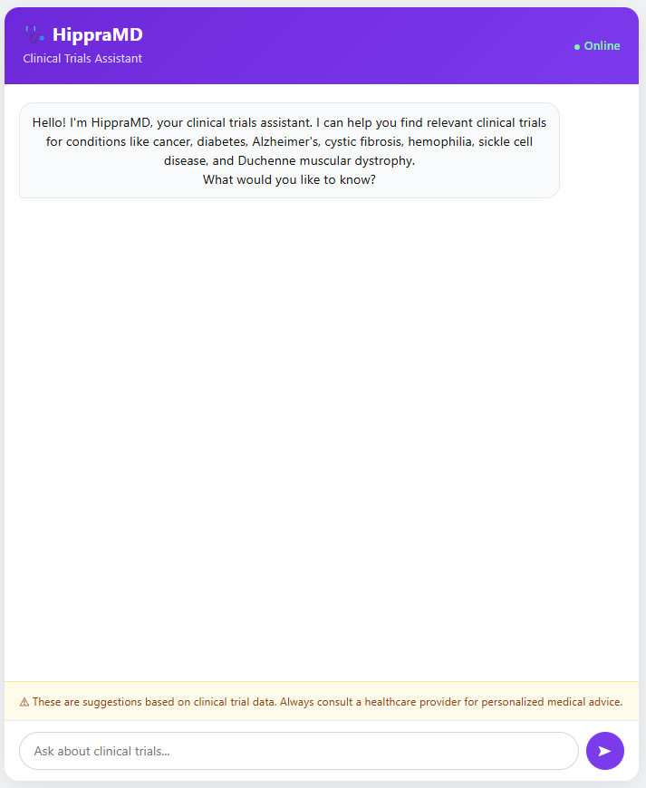
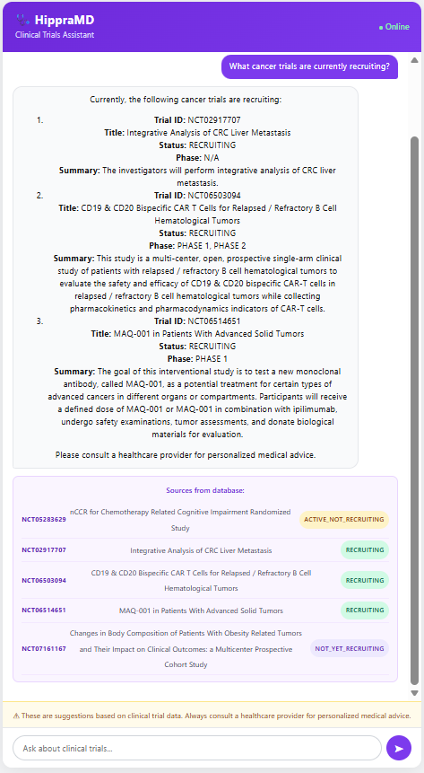
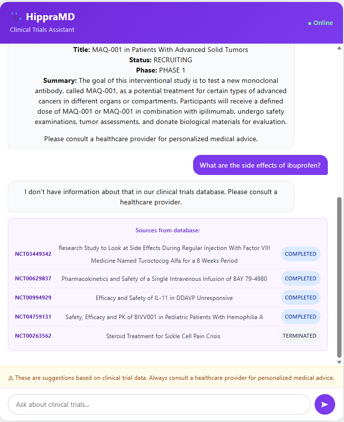

# 🩺 MediHippraMD — Clinical Trials RAG-Chatbot by Soham

> A RAG-powered (Retrieval-Augmented Generation) medical assistant that helps patients and doctors find relevant clinical trials — built for the **Hippra** platform.

---

## 📸 Screenshots

### Welcome Screen


### Searching Clinical Trials


### Handling Out-of-Scope Questions


---

## 🧠 What Problem Does This Solve?

The previous chatbot had a critical reliability issue — **it gave different answers to the same question every time**. This happened because:

- The LLM temperature was not set (defaulted to ~0.7), introducing randomness into every response
- The chatbot answered from general medical knowledge instead of the actual clinical trials database
- It retrieved only 1 document chunk, making answers inconsistent and unreliable
- There were no guardrails to prevent the model from hallucinating trial IDs or citing fake sources

**HippraMD fixes all of this** by grounding every answer strictly in a verified database of 840 real clinical trials, using `temperature=0` for fully deterministic responses.

---

## ✅ Key Features

- **Consistent answers** — `temperature=0` means the exact same question always gets the exact same answer
- **RAG pipeline** — answers are retrieved from 840 real clinical trials, not generated from model memory
- **Grounded responses** — if the answer isn't in the database, the bot says so instead of making something up
- **Source transparency** — every answer shows the NCT trial IDs, titles, and recruitment status that were used
- **Conversation memory** — the bot remembers the last 6 messages for follow-up questions
- **Cross-disease search** — can find trials across all 7 disease categories in a single query
- **Medical disclaimer** — always reminds users to consult a healthcare provider

---

## 🗃️ Dataset

**840 clinical trials** across 7 disease categories, sourced from ClinicalTrials.gov:

| Disease | Trials |
|---|---|
| Cancer | 120 |
| Diabetes | 120 |
| Alzheimer's Disease | 120 |
| Cystic Fibrosis | 120 |
| Duchenne Muscular Dystrophy | 120 |
| Hemophilia | 120 |
| Sickle Cell Disease | 120 |

Each trial record contains: `nct_id`, `title`, `status`, `phase`, `disease`, and `summary`.

---

## 🏗️ Architecture

```
User Question
      ↓
React Frontend (Vite)
      ↓
FastAPI Backend
      ↓
Retriever → ChromaDB (searches top 5 most relevant trials)
      ↓
Prompt Builder (strict context-only instructions)
      ↓
OpenAI GPT-4o-mini (temperature=0)
      ↓
Answer + Sources → Frontend
```

### Why RAG instead of plain ChatGPT?

A plain LLM answers from its training data — which means it can generate plausible-sounding but incorrect trial IDs, outdated information, or completely fabricated studies. RAG forces the model to answer **only from your verified database**, making it reliable enough for a medical context.

---

## 🛠️ Tech Stack

| Layer | Technology |
|---|---|
| Frontend | React 19, Vite, react-markdown |
| Backend | FastAPI, Python |
| Vector Database | ChromaDB (persistent) |
| Embeddings | OpenAI `text-embedding-3-small` |
| LLM | OpenAI `gpt-4o-mini` |
| Styling | Inline React styles |

---

## 🚀 Local Setup

### Prerequisites
- Python 3.10+ (Anaconda recommended)
- Node.js 18+
- OpenAI API key

### 1. Clone the repository

```bash
git clone https://github.com/sohamchavan98/MediHippra-chatbot-by-Soham.git
cd MediHippra-chatbot-by-Soham
```

### 2. Backend setup

```bash
cd backend
pip install -r requirements.txt
```

Create a `.env` file inside `backend/`:

```env
OPENAI_API_KEY=your_openai_key_here
```

Run the ingestion script (one time only — loads all 840 trials into ChromaDB):

```bash
python ingest.py
```

Start the backend server:

```bash
uvicorn main:app --reload --port 8000
```

Verify it's working:

```bash
curl http://localhost:8000/health
# Expected: {"status":"ok","trials_loaded":840}
```

### 3. Frontend setup

```bash
cd ../frontend
npm install
npm run dev
```

Open `http://localhost:5173` in your browser.

---

## 📁 Project Structure

```
hippra-chatbot/
├── backend/
│   ├── data/                  # 7 JSON files with clinical trial data
│   │   ├── cancer.json
│   │   ├── diabetes.json
│   │   ├── alzheimers_disease.json
│   │   ├── cystic_fibrosis.json
│   │   ├── duchenne_muscular_dystrophy.json
│   │   ├── hemophilia.json
│   │   └── sickle_cell_disease.json
│   ├── chroma_db/             # Auto-generated vector store (after ingest.py)
│   ├── ingest.py              # One-time script to embed trials into ChromaDB
│   ├── main.py                # FastAPI server with RAG pipeline
│   ├── requirements.txt
│   └── .env                   # Your OpenAI API key (not committed to git)
├── frontend/
│   ├── src/
│   │   └── App.jsx            # Full chat UI
│   ├── index.html
│   ├── package.json
│   └── vite.config.js
├── screenshots/               # UI screenshots for this README
└── README.md
```

---

## 🔍 How the RAG Pipeline Works

1. **Ingestion (one-time):** `ingest.py` reads all 840 trials, converts each one into a text block, generates an embedding using OpenAI's `text-embedding-3-small` model, and stores everything in ChromaDB.

2. **Query time:** When a user asks a question, the backend embeds the question using the same model, then searches ChromaDB for the 5 most semantically similar trials.

3. **Prompt construction:** The retrieved trials are injected into a strict system prompt that instructs the model to answer only from the provided context and say "I don't know" if the answer isn't there.

4. **Generation:** GPT-4o-mini generates the answer at `temperature=0`, guaranteeing the same output for the same input every time.

5. **Response:** The answer and the source trial metadata are returned to the frontend together.

---

## ⚠️ Important Notes

- The `backend/.env` file containing your OpenAI API key is excluded from git via `.gitignore` — never commit it
- The `chroma_db/` folder is also excluded — each deployment runs `ingest.py` once to rebuild it
- This chatbot is for informational purposes only — always consult a healthcare provider for medical decisions

---

## 👤 Author

**Soham Chavan**  
Built as part of the Hippra platform development.

---

## 📄 License

MIT License — feel free to use and adapt this project.